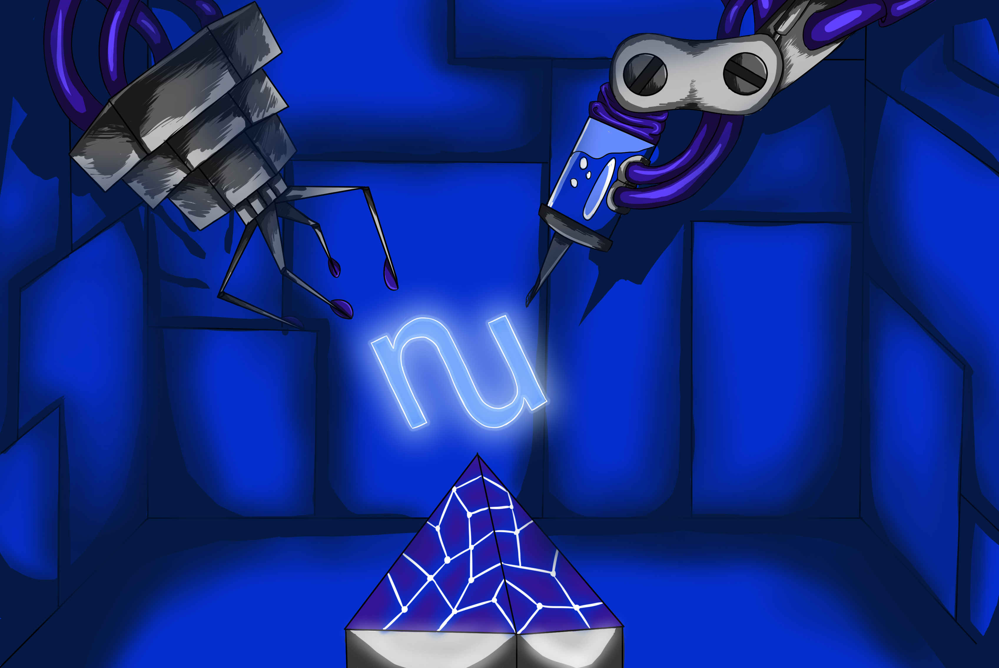

# Pre-Release Epics

Before this codebase was ready for any kind of organized release methodology, we began the process of opening epic branches - branches into which feature-related PRs were open, but which didn't necessarily result in a passing test suite until their conclusion.

For any reader trying to piece together the history of innovations in NuCypher, understanding these epics and their role in the evolution of our network is a must.

## Coffee
**10 Jul 2018 <https://github.com/nucypher/nucypher/pull/286>**

*Named because @jMyles and @kPrasch really needed some when they finally pushed the first breakages that led to this epic.*

* **Associated homecoming**: Portland / Pedalpalooza

In a sense, Coffee is the canonical epic in the NuCypher development cycle.  It was the first codebase to be used in live demos and in hackathon projects.

It introduced the first fully-working relationship between the Characters who are arguably most fundamental in understanding the NuCypher cryptology: Alice and Ursula.

Coffee was the first epic which brought a usable Arrangement API and regarded the Arrangement as the fundamental representation of a relationship between Alice, Ursula, and Bob - now a mainstay of the NuCypher network.

It also included the first seeds of many of the metaphors that have become common vernacular on the team: "dividing" a stake, the "learning loop", "NetworkMiddleware", and node verification.

## Kokonusswasser
**28 Sep 2018 <https://github.com/nucypher/nucypher/pull/435>**

*Named because the team was learning German and drinking coconut water.*

* **Associated homecoming**: Berlin / Web3

Kokonusswasser represented a realization (perhaps an admission, depending on your view) that NuCypher needed to reinvent some of the basic tooling of a decentralized network in order to be viable for use in the near-term.  

Examples include deprecating the DHT in favor of the Learning Loop, the dispatcher pattern for smart contracts, and a flat contract registry.

Kokonuswasser also introduced Vladimir, a metaphor for an unlawful, selfish node, and the first fully functional CLI interface to the project.

## Cedar
**18 Nov 2018 <https://github.com/nucypher/nucypher/pull/490>**

*Named as a homophone for "seeder", as this epic introduced our seeder contract and concepts.*

* **Associated homecoming**: Prague / Devcon4

The team hacked and slashed to prepare our first devnet for several "off Devcon" events, at which we presented demos using our first 10 public federated nodes.

Finally coming to initial fruition around a table at a small restaurant in Prague (w/ @kprasch, @jMyles, @mswilkison, and @tuxxy frantically pecking), the devnet was demoed just an hour later.

Following our first devnet demo, Cedar brought all of the changes that we launched into a more sane domain, adding tests for launch logic, docstrings, and logging statements throughout the codebase.  We also began reporting log emissions to Sentry.

A lot of automation for deployment also landed in Cedar, including Ansible playbooks, our first status page, and the "nickname" scheme, in which a pronounceable name is derived from a node's checksum address.

## Alpha

*Although not associated with an epic branch, we conducted an Alpha Distribution release on Jan 29, 2019*

Our Alpha release including a metric bajillion bugfixes, along with documentation, testing, tightened-up CI configuration, and our "heartbeat" demo.

## Carrot Juice
**15 Feb 2019 <https://github.com/nucypher/nucypher/pull/760>**

*Named because jMyles had had enough coffee and needed a change.*

* **Associated homecoming**: Denver / ETHDenver

Focused on demo robustness and introducing relatively few features, Carrot Juice brought stability and sanity to some of the cutting-edge features developed up until then.

Carrot Juice was the introduction of dual-use interfaces, meant both for live demos and for use by the public at large.

Featuring 81 commits in the 24 hours leading up to the ETHDenver demo, Carrot Juice introduced Moe, our first "chaotic" character, and "MiddlewareClientWithConnectionProblems", our first network component focused entirely on testing how the network handles downtime.

Carrot Juice was the basis for the ETHDenver demo:

<iframe width="560" height="315" src="https://www.youtube.com/embed/om0tew-Z4gE" frameborder="0" allow="accelerometer; autoplay; encrypted-media; gyroscope; picture-in-picture" allowfullscreen></iframe>

## Vodka
**25 Feb 2019 <https://github.com/nucypher/nucypher/pull/507>**

Our longest running epic - open for an entire season - Vodka offered a major critique to a several cryptoeconomic norms, most notably offering a zero-knowledge verification of re-encryption correctness.

Vodka introduced a mutual commitment from Bob and Ursula, who now sign the input and output of each re-encryption request. This represents the first time that Bob and Ursula have shared a common political view of the network, which is crucial for introducing accountability (including slashing) for our re-encryption service.

We also adopted our Numerology project, which performs elliptic-curve arithmetic in Solidity.

*Vodka* is a wonderful read with annotations, as it contains exciting and creative interplay between @szotov and @cygnusv.
